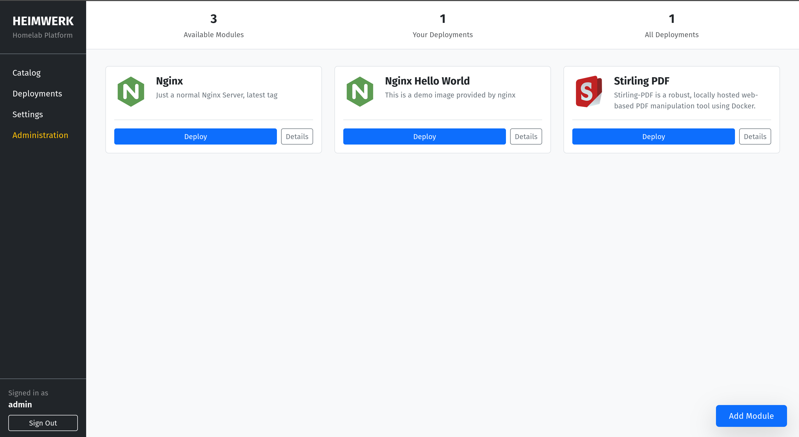
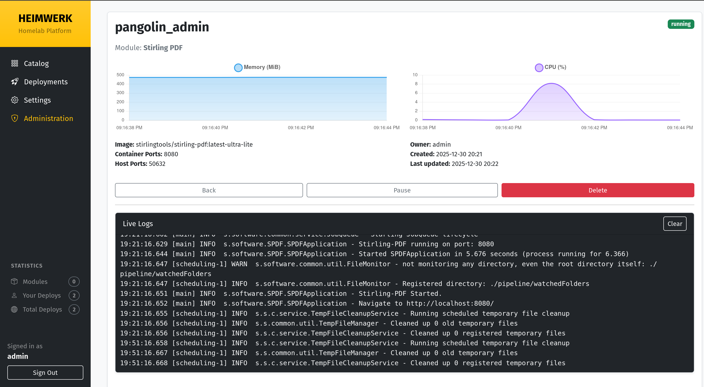

[](https://sonarcloud.io/summary/new_code?id=arsiba_heimwerk)

# Heimwerk

[](docs/TODO.md)
[](docs/TODO.md)

[](https://sonarcloud.io/summary/new_code?id=arsiba_heimwerk)
[](https://sonarcloud.io/summary/new_code?id=arsiba_heimwerk)
[](https://sonarcloud.io/summary/new_code?id=arsiba_heimwerk)

**Heimwerk** is a platform for deploying Docker containers, designed to empower users by providing easy, self-service access to homelab resources. It enables administrators to share server capabilities securely and effortlessly, allowing users to deploy services from a prebuilt catalog with a single click while maintaining a standardized and controlled environment.

The recommended use case is in combination with **Pangolin**, to automatically make deployed services accessible to the user, including subdomain, network rules, and access control.




---

## Features

* **Catalog Management**: Maintain a catalog of prebuilt Docker modules.
* **One-Click Deployment**: Safe and straightforward self-service for sharing resources.
* **Pangolin Integration**: Automatic network configuration and access control (recommended).
* **Extensible**: Easily add new modules to the catalog.
* **Real-time Monitoring**: (In progress) Statistics for deployed instances via WebSockets.

## Tech Stack

- **Language:** Python 3.10+
- **Framework:** Django 5.2.x, Django Channels
- **Package Manager:** pip
- **Database:** SQLite (default for development)
- **Containerization:** Docker (via Docker SDK for Python)
- **Web Server:** Daphne (for ASGI/WebSocket support)

## Requirements

- Python 3.10 or higher
- Docker installed and running
- Access to Docker API (see [Development](#development) section)

## Setup & Installation

1. **Clone the repository:**
   ```bash
   git clone https://github.com/arsiba/heimwerk.git
   cd heimwerk
   ```

2. **Create and activate a virtual environment:**
   ```bash
   python -m venv .venv
   source .venv/bin/activate  # On Windows: .venv\Scripts\activate
   ```

3. **Install dependencies:**
   ```bash
   pip install -r requirements.txt
   ```

4. **Apply migrations:**
   ```bash
   python manage.py migrate
   ```

5. **Create a superuser:**
   ```bash
   python manage.py createsuperuser
   ```

## Running the Application

To start the development server with ASGI support:

```bash
python manage.py runserver
````

The application will be available at `http://127.0.0.1:8000`.

## Scripts & Management Commands

- `python manage.py runserver`: Start the development server.
- `python manage.py migrate`: Apply database migrations.
- `python manage.py createsuperuser`: Create an administrative user.
- `python manage.py test`: Run the test suite.
- `python manage.py collectstatic`: Collect static files for production.
- `python manage.py shell`: Open the Django interactive shell.

## Environment Variables

Currently, the project uses default Django settings. Future updates may include:

- `DEBUG`: Set to `False` in production.
- `SECRET_KEY`: Django secret key.
- `ALLOWED_HOSTS`: List of hosts allowed to access the site.
- **TODO**: Define app-specific environment variables for Docker host configurations and secure storage.

## Project Structure

```text
heimwerk/
├── apps/               # Django applications
│   ├── catalog/        # Module catalog management
│   ├── deployments/    # Instance and deployment logic
│   ├── hosts/          # Docker host management
│   └── users/          # User management and signals
├── config/             # Project configuration (settings, URLs, ASGI/WSGI)
├── core/               # Core logic and utilities
│   ├── docker/         # Docker SDK wrappers and deployment logic
│   └── utils/          # Common utilities
├── templates/          # Global HTML templates
├── docs/               # Documentation (TODOs, etc.)
├── manage.py           # Django management script
├── requirements.txt    # Python dependencies
└── pyproject.toml      # Build and tool configuration (Black, Isort)
````

## Testing

Run tests using the standard Django test runner:

```bash
python manage.py test
````

## Development

To run **Heimwerk** locally, you need a development Docker server with its API exposed over TCP. Follow these steps:

### 1. Stop the running Docker service
Before exposing the Docker API, stop the default Docker daemon:
```bash
sudo systemctl stop docker && sudo systemctl stop docker.socket
````

### 2. Start Docker with TCP API enabled

Start the Docker daemon manually, exposing both the TCP port (for Heimwerk) and the default Unix socket:

```bash
sudo dockerd -H tcp://0.0.0.0:2375 -H unix:///var/run/docker.sock
````

* `tcp://0.0.0.0:2375` — allows connections over TCP on all interfaces.
* `unix:///var/run/docker.sock` — keeps local Docker CLI commands functional.

### 3. Verify Docker TCP access

You can test the TCP API with:

```bash
curl http://localhost:2375/version
````

You should see JSON output containing Docker version information.

### Security Notice

Exposing Docker over TCP **without TLS** is insecure and allows full control of your system. For local development, it's recommended to either:

* Restrict the TCP endpoint to `127.0.0.1`:

```bash
sudo dockerd -H tcp://127.0.0.1:2375 -H unix:///var/run/docker.sock
````

* Or configure TLS for remote access in production environments.

### 4. Restart Docker after development

When finished, restart the standard Docker service:

```bash
sudo systemctl start docker
````

This setup allows Heimwerk to communicate with Docker for deploying and managing containers in your local dev environment.

## License

**TODO**: Specify the license for this project.


